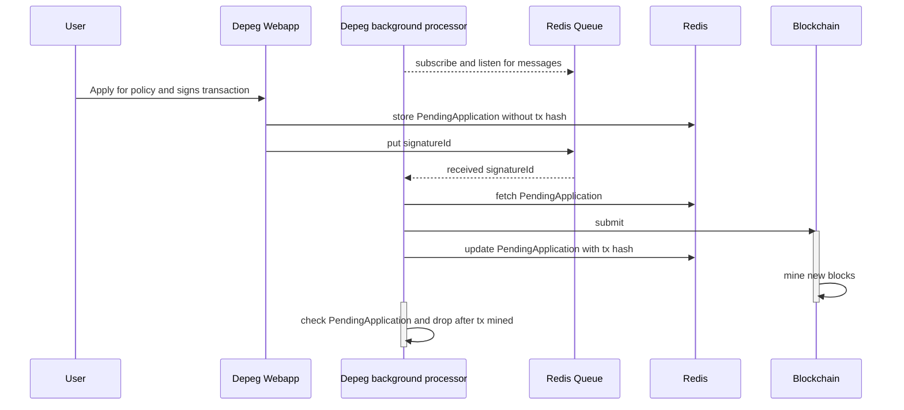

# Gasless application

## Sequence diagram

```mermaid
sequenceDiagram
    participant U as User
    participant D as Depeg Webapp
    participant BG as Depeg background processor
    participant RQ as Redis Queue
    participant R as Redis
    participant C as Blockchain
    
    BG -->> RQ: subscribe and listen for messages
    U ->> D: Apply for policy and signs transaction
    D ->> R: store PendingApplication without tx hash
    D ->> RQ: put signatureId
    RQ -->> BG: received signatureId
    BG ->> R: fetch PendingApplication
    BG ->> C: submit
    activate C
    BG ->> R: update PendingApplication with tx hash
    C ->> C: mine new blocks
    deactivate C
    activate BG
    BG ->> BG: check PendingApplication and drop after tx mined
    deactivate BG
```
