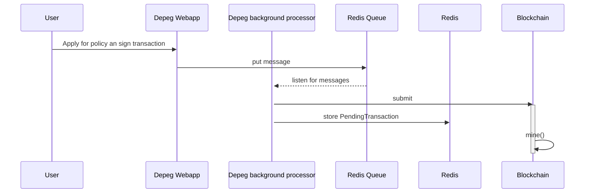

# Gasless application

## Sequence diagram

```mermaid
sequenceDiagram
    participant U as User
    participant D as Depeg Webapp
    participant BG as Depeg background processor
    participant RQ as Redis Queue
    participant R as Redis
    participant C as Blockchain
    
    U ->> D: Apply for policy an sign transaction
    D ->> RQ: put message
    RQ -->> +BG: listen for messages
    BG ->> C: submit
    activate C
    BG ->> R: store PendingTransaction
    C ->> C: mine()
    deactivate C
```
